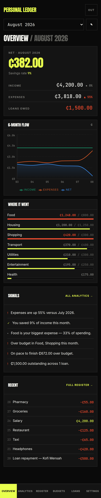
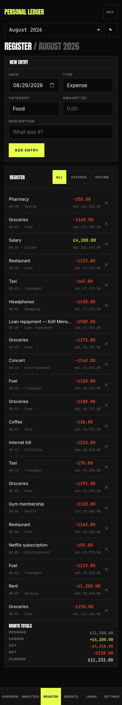
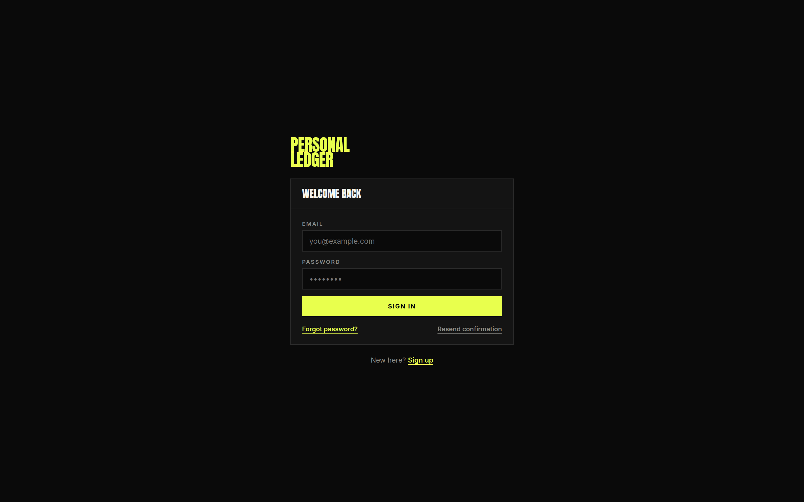
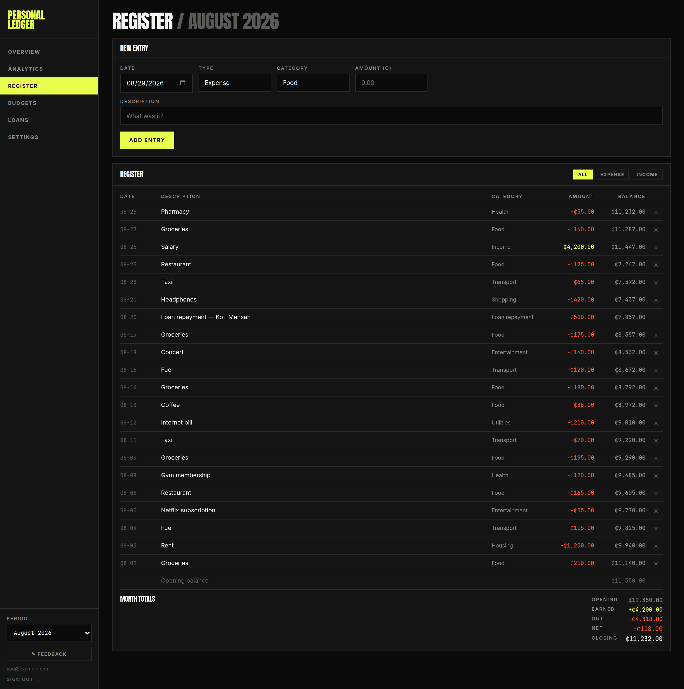
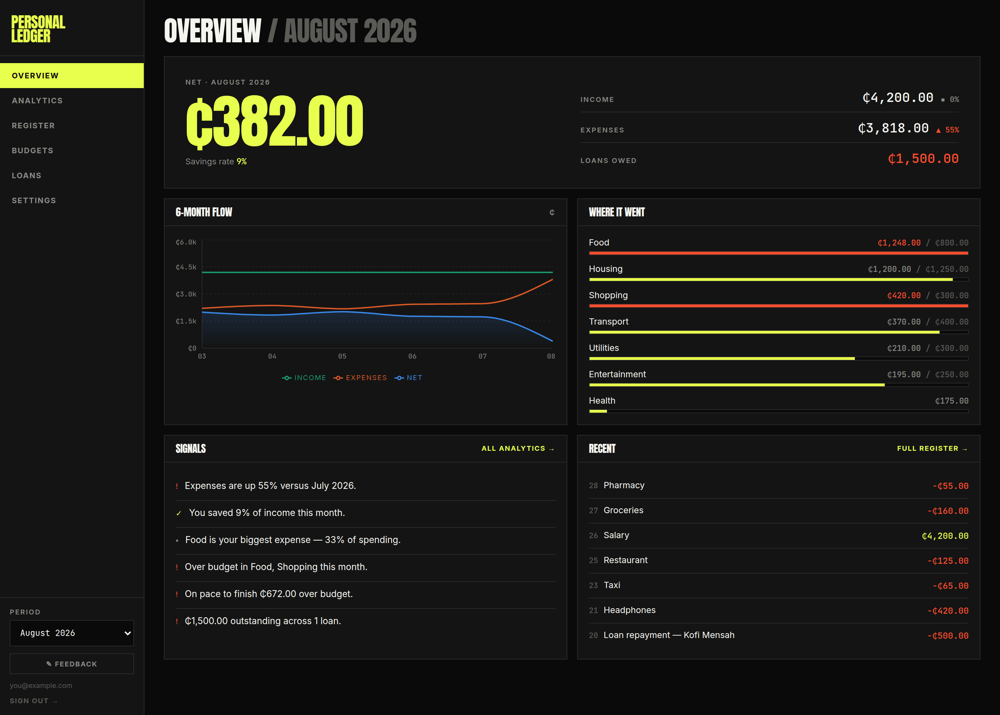
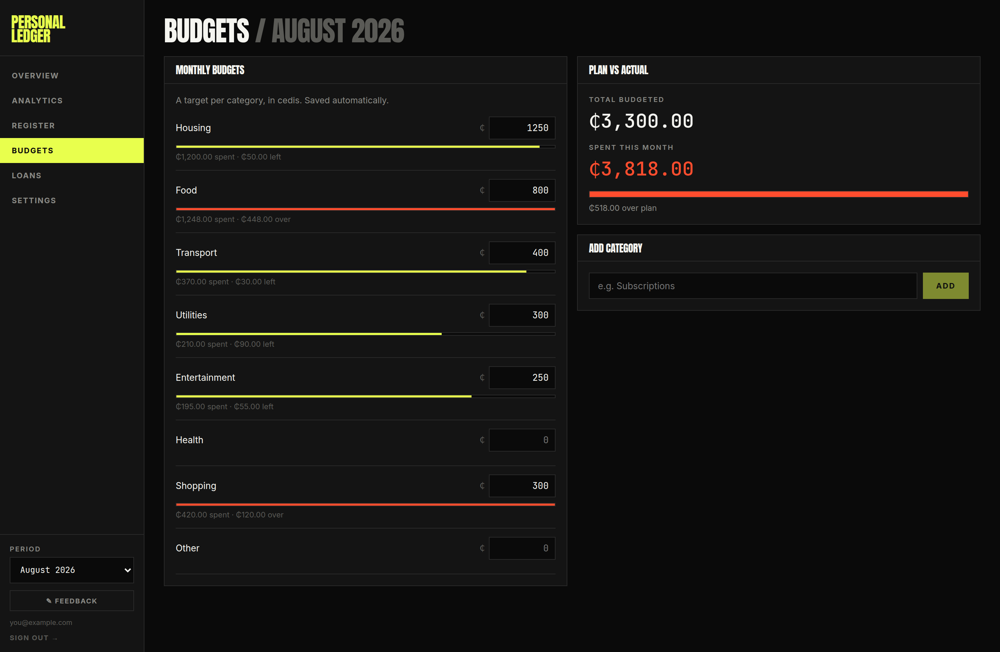
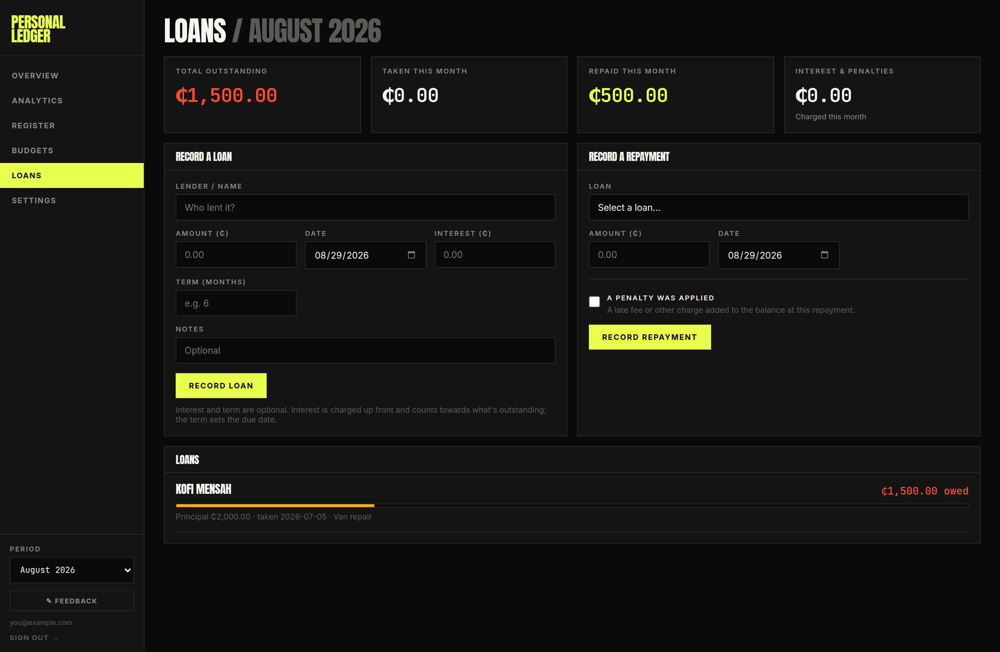
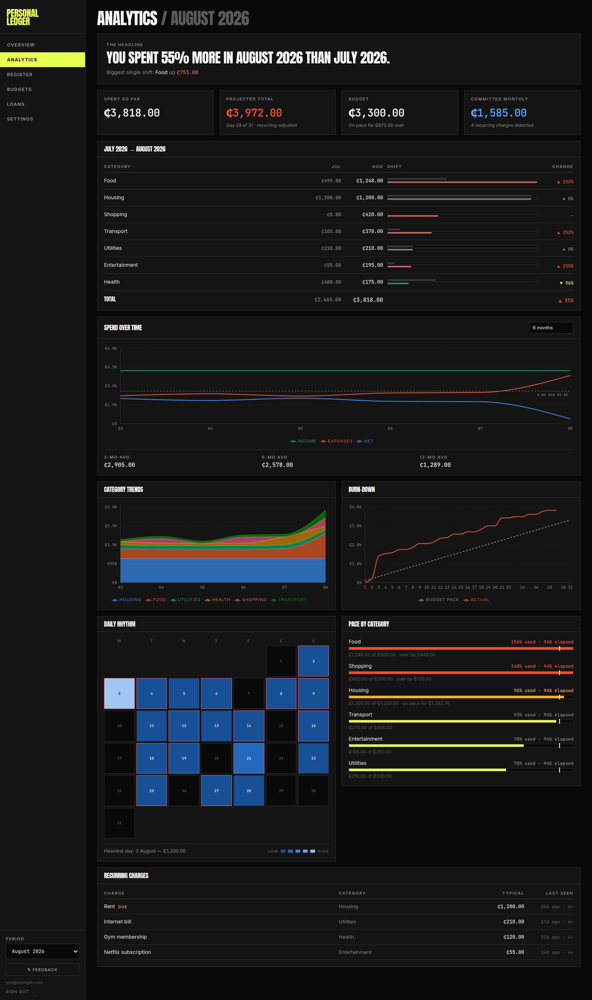
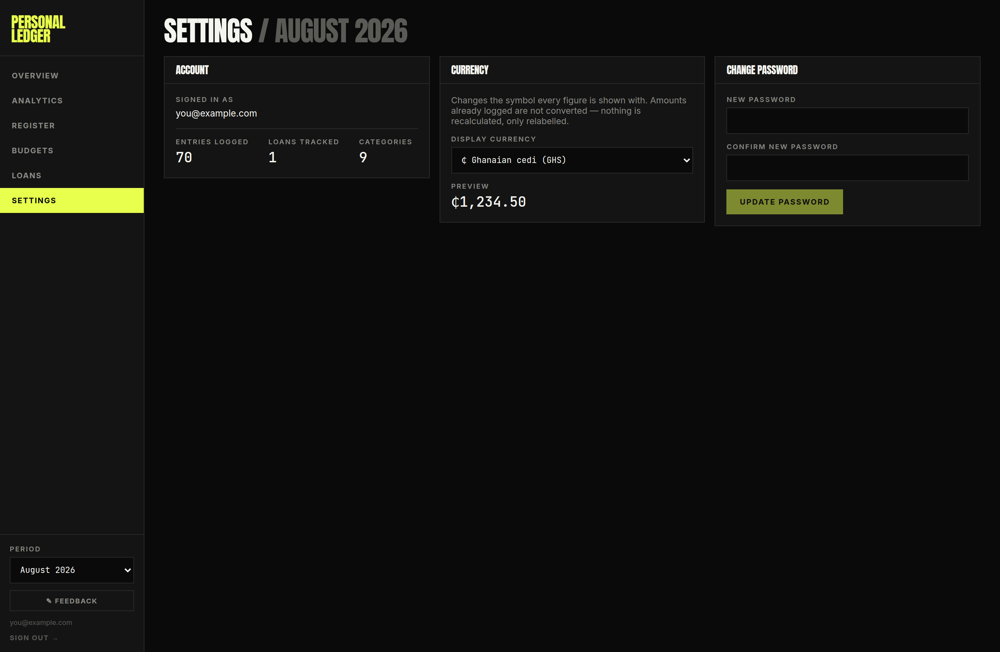

# User guide

## Overview

Personal Ledger keeps track of what you earn, what you spend, what you've
budgeted for, and what you owe. You work one month at a time. You log entries as
things happen, and the app does the arithmetic and tells you whether the month
is going the way you planned.

Everything is private to your account. Nobody else can see your entries, and no
data is shared between accounts.

The app works the same way on a phone as on a laptop. On a phone the sidebar
turns into a row of tabs across the bottom, and the wide tables turn into
stacked cards.

| Overview on a phone | Register on a phone |
| --- | --- |
|  |  |

> **About these screenshots.** They come from a demo account filled with made up
> data. Every figure, category and name in them is invented. The app may have
> changed since they were taken.

## Getting in



### First time

1. Open the app and click **Sign up**.
2. Enter your email and a password of at least 6 characters.
3. Check your email, click the confirmation link, then come back and sign in.

If the confirmation email doesn't turn up, put your email in the field and click
**Resend confirmation**. Sending is limited to a handful of emails an hour, so
if several people sign up at once, give it a few minutes rather than clicking
again and again.

Your account starts with nine categories ready to use: Housing, Food, Transport,
Utilities, Entertainment, Health, Shopping, Income and Other. You can add more
whenever you like.

### Forgot your password

Click **Forgot password?** on the sign in screen, enter your email, and follow
the link that arrives. It takes you straight to a screen where you set a new
password.

### Signing out

Use **Sign out** at the bottom of the sidebar, or the **OUT** button at the top
right on a phone.

## The parts that are always there

Three controls sit outside the main screens and apply everywhere.

**The month picker** sits at the bottom of the sidebar, or under the title on a
phone. Everything you see on every screen is for the month you pick here.
Switching between screens never changes the month. The picker offers next month,
the last twelve months, and any older month that has entries in it, so nothing
you have logged ever becomes unreachable. Months with nothing in them say
**"empty"** next to the name, so you know before you switch.

**The navigation** takes you between Overview, Analytics, Register, Budgets,
Loans and Settings.

**Feedback** is the pencil button. It sends a note to whoever runs the app, and
records which screen you were on. You can't read your feedback back afterwards,
so keep a copy if you need one.

The heading on every screen tells you where you are and which month you're
looking at, like *Register / August 2026*.

## Your first ten minutes

1. Go to **Register** and add a few entries. Start with your last salary and
   this week's spending. Choose **Expense** or **Income**, pick a category,
   type the amount as a positive number, and say in a few words what it was.
2. Go to **Budgets** and set a monthly figure for the categories you care about.
   You don't need to do all of them. Three or four is enough to make the rest of
   the app useful.
3. Go to **Overview**. The big number is what you have left over this month.
4. If you owe anyone money, go to **Loans** and record it.

That's the whole loop. Everything else in the app is another way of reading
those entries back to you.

## Register, where you log what happened



This is where entries go in, and where you check them afterwards. Think of it as
your account statement: what actually moved, in the order it moved.

### Adding an entry

Fill in the form at the top.

| Field | What to put in it |
| --- | --- |
| **Date** | Starts on today. You can backdate freely and the entry will file itself into the right month. |
| **Type** | Expense or Income. This is what sets the direction, so you always type a positive amount. |
| **Category** | Pick from your list. You add new ones on the Budgets screen. |
| **Amount** | Always positive. Don't type a minus sign. |
| **Description** | What it was. Try to be consistent, for reasons explained under [Recurring charges](#recurring-charges). |

The date and category stay as you left them after you add an entry, which makes
logging several things from the same day quick.

### Reading the register

Entries are listed newest first. The **Balance** column is a running total, so
each row's balance is the row below it plus that row's amount. The **Opening
balance** line at the bottom is what carried over from before this month, which
is what lets the column add up within the month instead of depending on your
whole history.

The **all**, **expense** and **income** buttons change what's listed. They don't
change the month totals, which always cover the whole month. The footer says so
while a filter is on.

### Month totals

```
Opening      what you started the month with
Earned       income you logged
Loan drawn   money that came in from a loan (only shown if there was any)
Out          everything that went out, including loan repayments
Net          Earned + Loan drawn − Out
Closing      Opening + Net
```

Loan money gets a line of its own instead of being counted as earnings. It is
money coming in, but it isn't income, because you have to give it back.

### Deleting

The **×** at the end of a row deletes that entry. There's no undo and no way to
edit, so to correct something you delete it and add it again.

Rows that came from a loan show a small dot instead of a ×. You manage those on
the Loans screen.

## Overview, how the month is going



This is the screen to open first. One look should tell you whether things are
fine.

**The big number** is your net for the month, meaning income minus expenses.
Green means you're ahead. Red means you spent more than you brought in.
Underneath it sits your **savings rate**, which is the share of your income you
didn't spend.

**Income and Expenses** sit beside it, each with a percentage against last
month. On the Expenses line, going up is coloured as bad and going down as good.
If you see a dash instead of a percentage, it means there's no last month to
compare against, not that nothing changed.

**Loans owed** only appears if you owe something.

**6 month flow** charts income, expenses and net across the last six months.

**Where it went** lists your biggest categories. When a category has a budget,
the bar shows how much of that budget you've used, and turns red once you go
over. When it doesn't have one, the bar shows that category's share of the
month's spending instead.

**Signals** is the app telling you what it noticed, such as whether spending is
up or down, what your biggest category is, which budgets you've gone through,
and whether you're on track to finish the month inside your plan.

**Recent** shows your last few entries. **All analytics** and **Full register**
take you to the fuller versions.

## Budgets, setting the plan



Type a monthly figure next to any category. It saves on its own about half a
second after you stop typing, so there's no save button to press. Clear the
field or set it to 0 to stop tracking that category.

Once a budget is set, the row shows a bar and tells you either how much you have
left or how far over you've gone.

**Plan vs actual** on the right gives you the two headline figures, total
budgeted and total spent this month, with a bar and a plain sentence like
"₵420.00 still unspent" or "₵180.00 over plan".

**Add category** sits at the bottom. Names ignore capitals, so you can't end up
with both "Food" and "food" in your list. You can add categories but you can't
rename or delete them, so pick names you'll be happy with later.

> **A note on "Spent this month" here.** This figure only counts the
> transactions you logged. If you were charged loan interest this month, the
> Overview will show a higher expenses figure than this screen does. This screen
> is about spending against your plan, and loan interest was never part of the
> plan. There's more on this under
> [Why don't these numbers match?](#why-dont-these-numbers-match)

## Loans, what you owe



This screen is for money you've borrowed, whether from a person or a lender.

### Recording a loan

**Lender / name**, **amount** and **date** are required. Two fields are
optional.

- **Interest** is a flat amount rather than a rate. It's charged once, up front,
  on the same date as the loan, and it counts towards what you owe.
- **Term (months)** sets a due date. Leave it blank for a loan with no end date.

While you fill the form, a line appears telling you what the loan will be
repayable at and when it falls due, so you can check before committing it.

### Recording a repayment

Pick the loan from the dropdown, which shows what's still outstanding on each
one, then enter what you paid and the date.

If you were charged a late fee, tick **"A penalty was applied"** and enter it
separately. The penalty gets added on top of what you owe, and the amount above
stays as what you actually handed over.

### Reading the list of loans

Each loan shows what's still owed, or says **PAID OFF**, with a progress bar.
The bar measures repayment against the total charged, which is the principal
plus interest plus any penalties. That means a loan with interest on it isn't
finished when the principal is back.

Loans past their due date are flagged **OVERDUE**, with how many days late they
are.

### The four tiles

**Total outstanding** covers all your loans across all time, so it doesn't
change when you switch months. The other three, **taken**, **repaid** and
**interest and penalties**, are for the month you've picked.

### What you can't do

Once recorded, a loan, a repayment or a penalty can't be edited or deleted.
Check your figures before you submit.

## Analytics, the detail



Everything here is about the month you've picked, apart from the charts, which
look back from it.

### The headline

One sentence, along the lines of *"You spent 18% more in August 2026 than July
2026."* Underneath it, the single category that moved the most.

### The four tiles

| Tile | What it means |
| --- | --- |
| **Spent so far** | What the month has cost you up to now |
| **Projected total** | What it's on track to cost by the end of the month |
| **Budget** | Your total plan, and whether you're on pace to stay inside it |
| **Committed monthly** | What your detected recurring charges add up to |

**Projected total** does something cleverer than doubling what you've spent so
far. The app works out which of your charges repeat every month and counts those
at their real amounts, using what you paid for the ones already paid and what
they usually cost for the ones still to come. Only the rest gets stretched out
across the month. Without that, paying rent on the 3rd would make every month
look like a disaster on the 4th.

The tile also tells you which day of the month you're on, and whether it used
that adjustment or fell back on a plain spending rate.

### Comparison against last month

Every category, last month next to this month, with paired bars and a percentage
change. Categories that dropped to nothing stay in the list so you can see them
go.

### Spend over time

Income, expenses and net across the last 3, 6 or 12 months, which you choose at
the top right. The dashed line is your average expense over six months.
Underneath, the same averages over 3, 6 and 12 months as figures.

Months with no entries count as zero in those averages. If you've only been
using the app for three months, your 12 month average will look low for that
reason.

### Category trends

Your six biggest categories, stacked, over the same window. Only six appear, so
if you have more than that the rest are left out and the stack can add up to
less than the month's expenses.

### Burn down

Your spending as it accumulates, against a straight line drawn from zero up to
your total budget. If your line sits above the dashed one, you're spending
faster than your plan allows. The line stops at today rather than running flat
to the end of the month.

### Daily rhythm

A calendar of the month, darkest on the days you spent most. Hover over a day,
or tap it on a phone, to read the figure. Days that go over your average daily
budget get a red outline. Underneath, the heaviest day of the month.

### Pace by category

For each category with a budget: how much you've used, how much of the month has
gone by, and a white marker showing where your spending should be today.

- **Green** means you're on track.
- **Amber** means you're still under budget but spending fast enough to go over.
- **Red** means you're already over.

### Recurring charges

Charges the app has spotted repeating. It needs at least three similar charges,
roughly a month apart, with amounts within 15% of each other.

It matches on your description and ignores numbers and punctuation, so "UBER
*TRIP 8821" and "Uber trip" count as the same thing. Consistent descriptions are
what make this work. If you write "Netflix" one month and "netflix sub" the
next, the app won't connect them.

Anything due again is flagged **DUE**. None of this is stored anywhere. It gets
worked out fresh every time you open the app, so it corrects itself as you log
more.

## Settings



**Account** shows your email and counts of what you've logged.

**Currency** changes the symbol on every figure in the app. It does not convert
anything. Your amounts stay exactly as you typed them and only the label
changes. A preview shows you what it will look like.

**Change password** needs at least 6 characters, entered twice.

## Why don't these numbers match?

This is the most common question, and usually nothing is broken. The app answers
two different questions about loans and keeps them apart.

**"What moved through my account?"** Borrowing money is money coming in.
Repaying it is money going out. Interest you haven't paid yet doesn't figure at
all. This is what the **Register** shows you, because that's what a running
balance means.

**"What did this month actually cost me?"** Borrowing ₵500 and handing ₵500 back
leaves you no worse off, so neither half of that counts as spending. What
borrowing really costs you is the interest, counted from when you're charged it.
This is what **Overview** and **Analytics** show you, so that a month's total
reflects how you lived rather than when you happened to borrow.

Both answers are right. They're answering different questions.

That leads to a few differences you should expect to see.

| What you notice | Why it happens |
| --- | --- |
| Overview expenses don't match Register "Out" | The register counts loan repayments, while the Overview counts loan interest instead |
| Overview expenses don't match Budgets "Spent this month" | Loan interest counts as an expense but has no budget line, so Budgets leaves it out |
| Register "Earned" doesn't match Overview income | Loan money gets its own line on the register and is never counted as income anywhere |
| Overview "Recent" shows a repayment the totals above it don't | That list is a preview of the register, so it follows what moved through the account |
| The category trends stack adds up to less than your expenses | The chart only shows your top six categories |
| Loans "Total outstanding" doesn't change with the month | It covers all time, while the three tiles beside it are monthly |

If two figures disagree in a way that isn't in this table, please report it
through **Feedback**.

The full technical account is in [calculations.md](calculations.md).

## Things to know

**You can't edit.** Entries can be deleted and added again. Loans and repayments
can't be touched at all once recorded.

**There's no undo.** Deleting an entry happens immediately and permanently.

**Categories can't be renamed or deleted.** Because the category name is stored
on each entry, a name is effectively permanent once you've used it.

**Spending under a deleted category still counts.** It shows up in your totals
even though it no longer has a row on the Budgets screen.

**Amounts are always typed as positives.** The Expense and Income toggle is what
sets the direction.

**Your data is private to your account.** Nothing is shared between users, and
feedback only travels one way, so you can't read yours back.

**Nothing is stored offline.** You need a connection.

## When something looks wrong

1. Check the **month picker**. Most reports of a missing entry turn out to be a
   month selected that the entry isn't in.
2. Check the **filter buttons** on the Register.
3. Look at the table above for a difference that's meant to be there.
4. Reload the page. Every figure is worked out again from scratch on each load.
5. If it still looks wrong, send it through **Feedback**, saying which screen
   you were on and what figures you expected.
